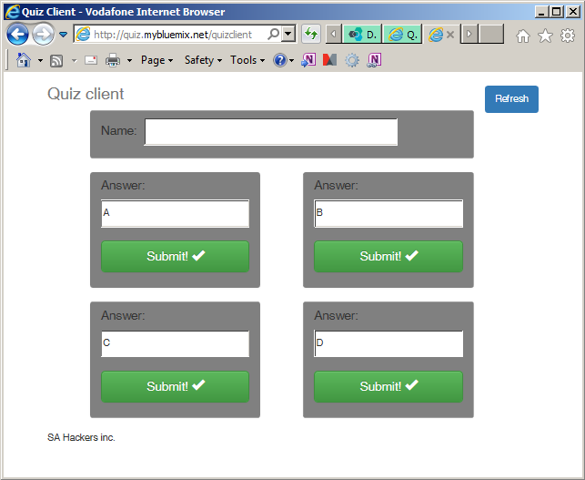
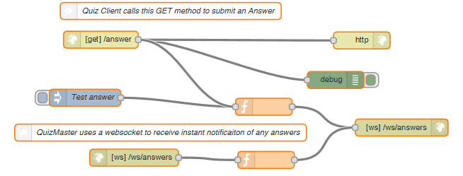
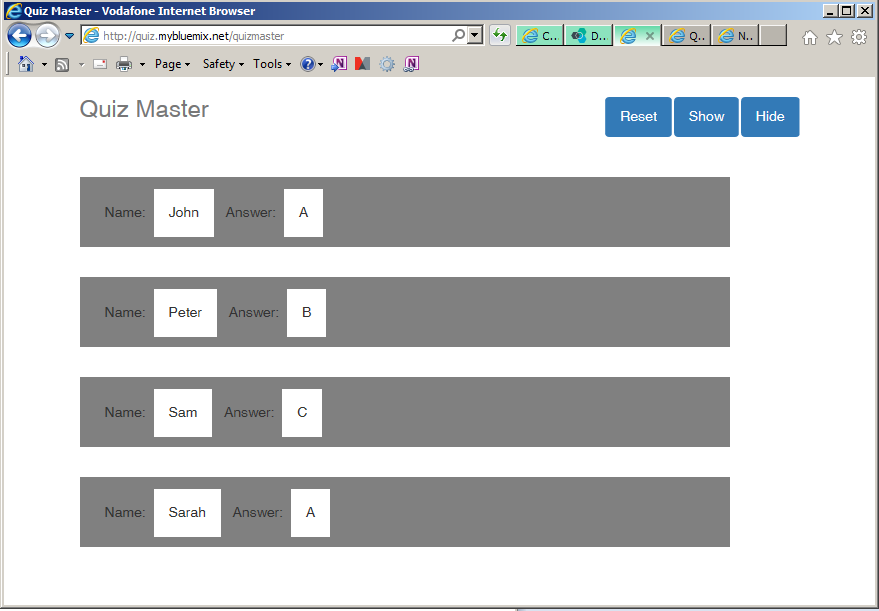
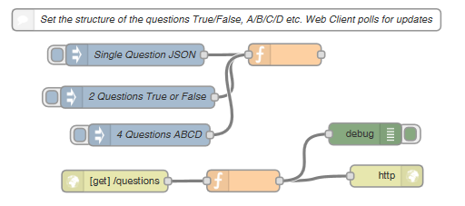

Quiz Master
===========

This application lets you host a quiz and have first-person-to-buzz functionality. There are two web-pages, the quiz-master and a quiz-client for each participant.

Quiz Client
----------



The Quiz Client a box for each answer and a submit button. Depending on the question, there can be 1 box (where you type the answer), 2 boxes (True/False) or 3 boxes (A/B/C/D).
The quiz client automatically polls for changes to the question structure.

When you press the submit button, the client calls a `GET` function that executes a Node-Red flow. This flow instantly updates the Quiz-Master web page via a WebSocket.




Quiz Master
-----------

The Quiz Master displays all the answers as they come in (first answer at the top). There is an option to show/hide the answer (to allow first-person-to-answer or all-answers-counted modes).




The person running the quiz can also set the structure for each client by pressing the blue input nodes directly into the node-red flow: 1 box (where you type the answer), 2 boxes (True/False) or 3 boxes (A/B/C/D).



These blue buttons inject a JSON structure to determine the number of boxes on each client and the content. At the moment, the Quiz Client allows for up to 4 boxes.

```
{"format":"2",
"answers":[
	{"visible":"on","answer":"True"},
	{"visible":"on","answer":"False"},
	{"visible":"off","answer":""},
	{"visible":"off","answer":""}
]}
```

