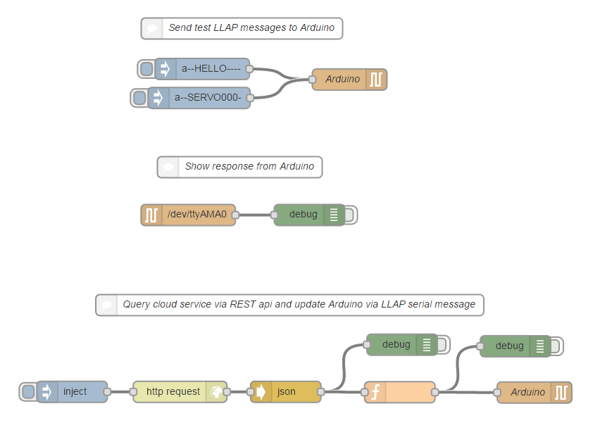

Cool-ometer
===========

This is a physical diplay with a large dial. In conjunction with the sentimentMeasure flow, it will displays the average sentiment of an audience. The audience 'vote' using a mobile-based HTML5 app and, a cloud service captures and aggregates the score and this display shows it using a servo-driven needle.

The Servo is controlled using a XINO RF Arduino-compatible board with a built-in radio serial interface. This interfaces to a slide-of-radio module installed on a Raspberry Pi. The XINO RF runs the standatd LLAP controller software; The Raspberry sends LLAP messages over the Radio serial interface. The message to set the Servo position is 'a--SERVO115-' where 'a--' is the id of the XINO RF module, 'SERVO' is the command to set the SERVO and '115' is the requessted angle (between 0-180 degrees). The trailing '-' is needed since all LLAP messages need to be 12 chars.

The flow gets the required sentiment by calling an API on the sentimentMeasure flow which returns the following result (only the avarage is used):

```
{
"average": 30.5,
"1423067625094": {
	"value": "11",
	"lastUpdate": 1423067682109
	},
"1423067678826": {
	"value": "50",
	"lastUpdate": 1423067681837
	}
}
```

Here is the flow:



