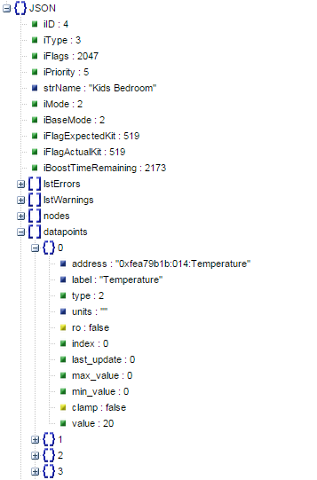

Log Heat Genius to Tinamous internet logging service
====================================================

This flow queries my Heat Genius to retrieve the Temperature, Activity and other details. It logs the value to Tinamous (https://lesterthomas.tinamous.com).


Here is the flow:


Here is a screenshot of the output at Tinamous:


The API to Heat Genius is not published: I scanned my network and found the following REST/JSON (you need to find your own signature by scanning your own network). `http://192.168.1.90:1223/Zone/<insert zone number>?sig=<insert signature>`. 

The JSON response is shown below (as a formatted screenshot and full JSON output)

 

```
{"iID":4,"iType":3,"iFlags":2047,"iPriority":5,"strName":"Kids Bedroom","iMode":2,"iBaseMode":2,"iFlagExpectedKit":519,"iFlagActualKit":519,
"iBoostTimeRemaining":2173,"lstErrors":[],"lstWarnings":[],
"nodes":
	[{"health":0,"hash":"0x0000000200040005","address":"0xfea79b1b:010","last_comms":1419787418,"location":"Bedroom 2"},
	{"health":0,"hash":"0x0000013c00020002","address":"0xfea79b1b:014","last_comms":1419786046,"location":"Bedroom 2"}],
"datapoints":
	[{"address":"0xfea79b1b:014:Temperature","label":"Temperature","type":2,"units":"",
	"ro":false,"index":0,"last_update":0,"max_value":0,"min_value":0,"clamp":false,"value":20},
	{"address":"0xfea79b1b:010:ThermostatRemoteSetting","label":"Valve Setting","type":5,"units":"",
	"ro":false,"index":0,"last_update":0,"max_value":0,"min_value":0,"clamp":false,"value":4},
	{"address":"0xfea79b1b:010:ThermostatLocalSetting","label":"Controller Setting","type":4,"units":"",
	"ro":false,"index":0,"last_update":0,"max_value":0,"min_value":0,"clamp":false,"value":4},
	{"address":"0xfea79b1b:014:Luminance","label":"Luminance","type":3,"units":"",
	"ro":false,"index":0,"last_update":0,"max_value":0,"min_value":0,"clamp":false,"value":1},
	{"address":"0xfea79b1b:014:ActivityCount","label":"Activity Level","type":7,"units":"",
	"ro":false,"index":0,"last_update":0,"max_value":0,"min_value":0,"clamp":false,"value":0},
	{"address":"0xfea79b1b:014:Int","label":"Sensitivity","type":0,"units":"",
	"ro":false,"index":0,"last_update":0,"max_value":0,"min_value":0,"clamp":false,"value":80}],
"bEnable":false,"fBoostSP":21,"bPrimaryZone":true,"iMinActivationTime":900,"fFrostLowSP":4,"fFrostHighSP":6,"fWeatherCompDatum":15,"fWeatherCompFactor":0.5,"strFootprintType":"WEEKLY",
"iLogPeriod":300,"iMode":2,"tmMaxTimeAtSP":1800,"fLinkSP":21,"bEnableWarmupDuration":false,"bEnableWarmupCalcs":false,"objFootprint":{"iProfile":1,"iOnGapSize":60,"iOffGapSize":60,
"fThresholdPIR":1,"fFootprintActiveSP":20,"fFootprintNightSP":16,"fFootprintAwaySP":14,"fFootprintThreshold":2.5,"iFootprintTmNightStart":75600,"iFootprintTmNightEnd":23400,"objReactive":{"iReactiveMinutesTriggerOn":5,"iReactiveMinutesTriggerOff":5,"fActivityLevel":0,"fOnThreshold":1,"fOffThreshold":1,"iSensitivity":80,"bReactiveTrigger":false},
"lstSP":
	[{"iDay":0,"iTm":0,"fSP":16},
	{"iDay":0,"iTm":23400,"fSP":14},
	{"iDay":0,"iTm":35400,"fSP":20},
	{"iDay":0,"iTm":41100,"fSP":14},
	{"iDay":0,"iTm":55800,"fSP":20},
	{"iDay":0,"iTm":60900,"fSP":14},
	{"iDay":0,"iTm":69300,"fSP":20},
	{"iDay":0,"iTm":75600,"fSP":16},
	{"iDay":0,"iTm":86399,"fSP":0},
	{"iDay":1,"iTm":0,"fSP":16},
	{"iDay":1,"iTm":23400,"fSP":14},
	{"iDay":1,"iTm":71400,"fSP":20},
	{"iDay":1,"iTm":75600,"fSP":16},
	{"iDay":1,"iTm":86399,"fSP":0},
	{"iDay":2,"iTm":0,"fSP":16},
	{"iDay":2,"iTm":23400,"fSP":14},
	{"iDay":2,"iTm":24300,"fSP":20},
	{"iDay":2,"iTm":44100,"fSP":14},
	{"iDay":2,"iTm":57600,"fSP":20},
	{"iDay":2,"iTm":75600,"fSP":16},
	{"iDay":2,"iTm":86399,"fSP":0},
	{"iDay":3,"iTm":0,"fSP":16},
	{"iDay":3,"iTm":23400,"fSP":14},
	{"iDay":3,"iTm":25200,"fSP":20},
	{"iDay":3,"iTm":32100,"fSP":14},
	{"iDay":3,"iTm":66900,"fSP":20},
	{"iDay":3,"iTm":75600,"fSP":16},
	{"iDay":3,"iTm":86399,"fSP":0},
	{"iDay":4,"iTm":0,"fSP":16},
	{"iDay":4,"iTm":23400,"fSP":14},
	{"iDay":4,"iTm":65700,"fSP":20},
	{"iDay":4,"iTm":75600,"fSP":16},
	{"iDay":4,"iTm":86399,"fSP":0},
	{"iDay":5,"iTm":0,"fSP":16},
	{"iDay":5,"iTm":23400,"fSP":14},
	{"iDay":5,"iTm":41400,"fSP":20},
	{"iDay":5,"iTm":59100,"fSP":14},
	{"iDay":5,"iTm":70200,"fSP":20},
	{"iDay":5,"iTm":75600,"fSP":16},
	{"iDay":5,"iTm":86399,"fSP":0},
	{"iDay":6,"iTm":0,"fSP":16},
	{"iDay":6,"iTm":23400,"fSP":14},
	{"iDay":6,"iTm":28200,"fSP":20},
	{"iDay":6,"iTm":46200,"fSP":14},
	{"iDay":6,"iTm":68400,"fSP":20},
	{"iDay":6,"iTm":75600,"fSP":16},
	{"iDay":6,"iTm":86399,"fSP":0}]},
"objTimer":
	[{"iDay":0,"iTm":0,"fSP":0},
	{"iDay":0,"iTm":25200,"fSP":21},
	{"iDay":0,"iTm":27900,"fSP":0},
	{"iDay":0,"iTm":68400,"fSP":21},
	{"iDay":0,"iTm":75600,"fSP":0},
	{"iDay":1,"iTm":0,"fSP":0},
	{"iDay":1,"iTm":25200,"fSP":21},
	{"iDay":1,"iTm":27900,"fSP":0},
	{"iDay":1,"iTm":68400,"fSP":21},
	{"iDay":1,"iTm":75600,"fSP":0},
	{"iDay":2,"iTm":0,"fSP":0},
	{"iDay":2,"iTm":25200,"fSP":21},
	{"iDay":2,"iTm":27900,"fSP":0},
	{"iDay":2,"iTm":68400,"fSP":21},
	{"iDay":2,"iTm":75600,"fSP":0},
	{"iDay":3,"iTm":0,"fSP":0},
	{"iDay":3,"iTm":25200,"fSP":21},
	{"iDay":3,"iTm":27900,"fSP":0},
	{"iDay":3,"iTm":68400,"fSP":21},
	{"iDay":3,"iTm":75600,"fSP":0},
	{"iDay":4,"iTm":0,"fSP":0},
	{"iDay":4,"iTm":25200,"fSP":21},
	{"iDay":4,"iTm":27900,"fSP":0},
	{"iDay":4,"iTm":68400,"fSP":21},
	{"iDay":4,"iTm":75600,"fSP":0},
	{"iDay":5,"iTm":0,"fSP":0},
	{"iDay":5,"iTm":25200,"fSP":21},
	{"iDay":5,"iTm":27900,"fSP":0},
	{"iDay":5,"iTm":68400,"fSP":21},
	{"iDay":5,"iTm":75600,"fSP":0},
	{"iDay":6,"iTm":0,"fSP":0},
	{"iDay":6,"iTm":25200,"fSP":21},
	{"iDay":6,"iTm":27900,"fSP":0},
	{"iDay":6,"iTm":68400,"fSP":21},
	{"iDay":6,"iTm":75600,"fSP":0}],
"lstLinkedTo":[],
"warmupDuration":{"iLagTime":1788,"iRiseTime":3600,"iTotalTime":3600,"fRiseRate":0,"bEnable":true,"bEnableCalcs":true},
"fPV":20,"fSP":0,"iActivity":0,"strStatus":"","bOutRequestHeat":false,"bInHeatEnabled":false,"bTriggerWarmup":false,"tmTimeAtSP":0,
"lstNodes":
	[{"strAddress":"0xfea79b1b:010","strType":"Radiator Valve (v2)","iHealth":0,"lstValues":[{"strName":"Valve Setting","strValue":"4.000000"},{"strName":"Controller Setting","strValue":"4.000000"},{"strName":"Battery (%)","strValue":"91"}]},{"strAddress":"0xfea79b1b:014","strType":"Room Sensor","iHealth":0,"lstValues":[{"strName":"Activity Level","strValue":"0"},{"strName":"Temperature","strValue":"20.000000"},{"strName":"Luminance","strValue":"1.000000"},{"strName":"Battery (%)","strValue":"100"},{"strName":"Sensitivity","strValue":"80"}]}],"warmupDuration":{"iLagTime":1788,"iRiseTime":3600,"iTotalTime":3600,"fRiseRate":0,"bEnable":true,"bEnableCalcs":true},"zoneReactive":{"iReactiveMinutesTriggerOn":5,"iReactiveMinutesTriggerOff":5,"fActivityLevel":0,"fOnThreshold":1,"fOffThreshold":1,"iSensitivity":80,"bReactiveTrigger":false}}
```
