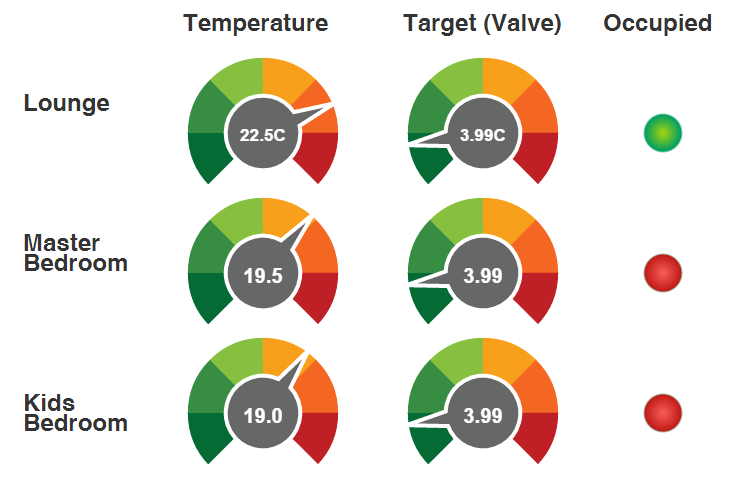
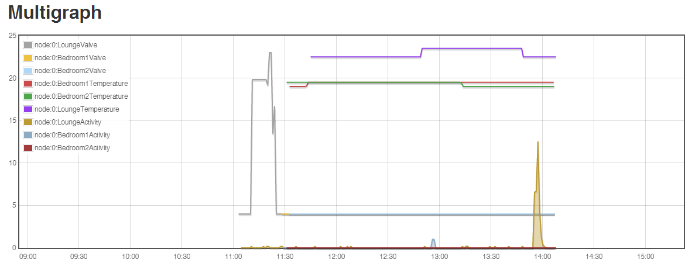
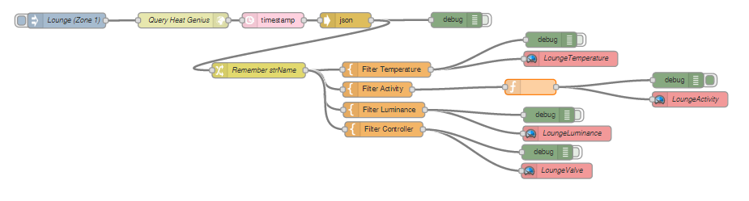

Log Heat Genius to Emoncms.org internet logging service
=======================================================

This flow queries my Heat Genius to retrieve the Temperature, Activity and other details. It logs the value to Emoncms.org (https://Emoncms.org). Emoncms is an open-source web-app for processing, logging and visualising energy, temperature and other environmental data (Part of the OpenEnergyMonitor.org project).
In Emoncms, I have created a Dashboard and Graph of all the inputs. See below for screenshots (you can click the live link to see the real data)

Live Link: http://emoncms.org/dashboard/view?id=18506

Live Link: http://emoncms.org/vis/multigraph?mid=5417

For more details on the API to Heat Genius, see my previous entry: <a href="https://github.com/LesterThomas/NodeRed-flows/tree/master/Log%20Heat%20Genius%20to%20Tinamous#log-heat-genius-to-tinamous-internet-logging-service">Heat Genius internet logging</A>

The node-red flow is:

