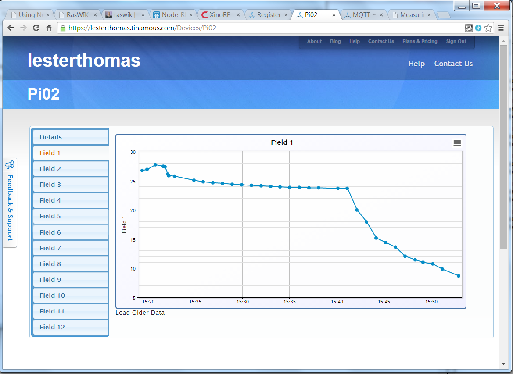

Log Temperature to Internet
===========================

This flow reads uses a Ciseco XinoRF Arduino (http://shop.ciseco.co.uk/xinorf-100-arduino-uno-r3-based-dev-board-with-radio-transciever/) to connect wirelessly to a Raspberry Pi (With Ciseco Slice of Radio). It reads the temperature of a temperature sensor and logs the value to Tinamous (https://lesterthomas.tinamous.com).

The flow sends LLAP messages over the radio interface. The message to request the temperature (Analogue input 0) is `a--A00READ--` where `a--` is the name of the Arduino (default setting) and `A00READ` is the message to request input A00. The last two `--` are to pad the message out to 12 characters.

Here is the flow:

Here is a screenshot of the output at Tinamous:

