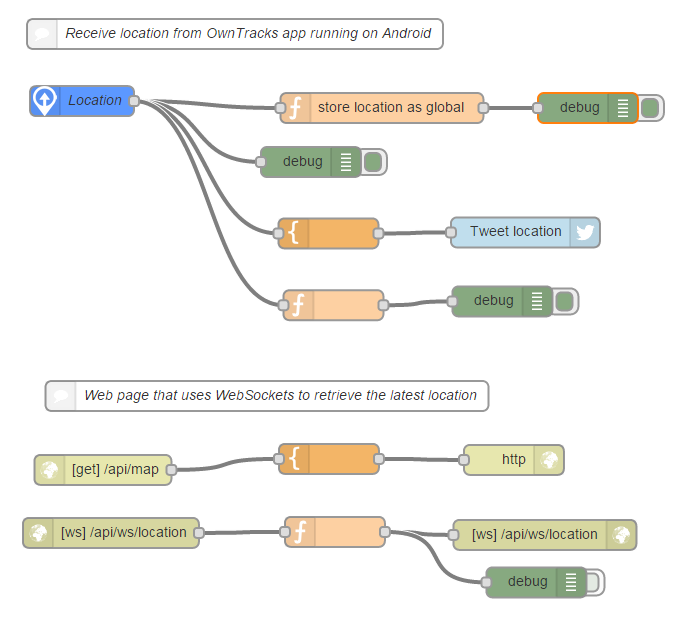
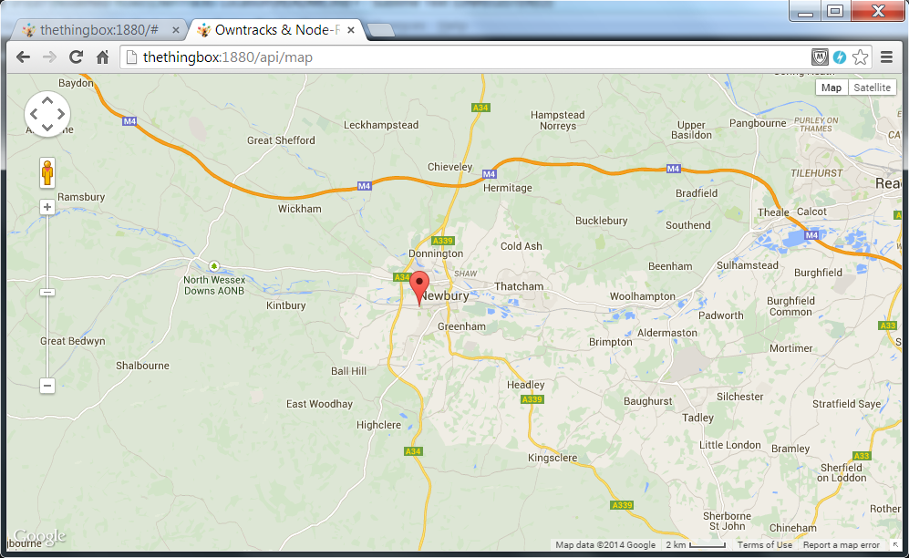

OpenTracks Location tracker
===========================

This application receives MQTT from the OwnTracks Android App. It stores the location in a Global context variable and then provides a WebPage view of the location. 

Here is the flow:

Here is the screenshow of the web app:

