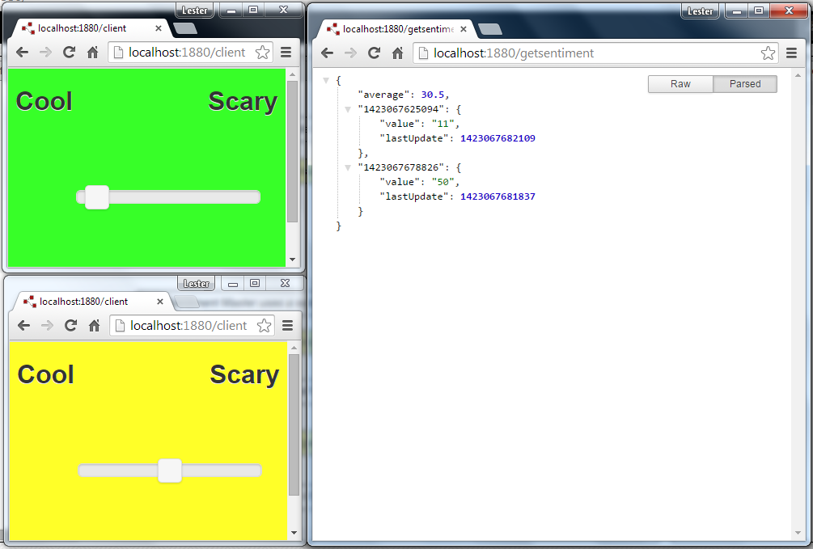
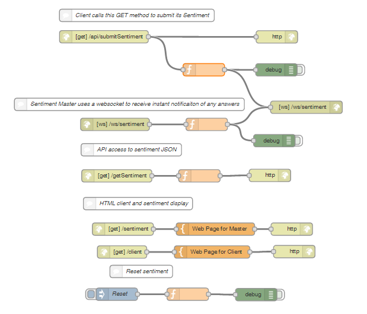

Audience feedback capture
=========================

This application lets you capture audience feedback by letting the audience use a simple mobile client. The overall feedback can be viewed on both a browser-based view or via an API (designed to work with a physical 'cool-ometer' display (see my other Node-Red project). 

The client has a simple slider to capture feedback (from Cool to Scary in the screenshot below). The screenshot shows two clients and then the JSON response to the API.



Here is the flow:



The JSON format uses timestamps to anonymously identify clients (and to remove them 5 seconds after they leave) 
```
{
"average": 30.5,
"1423067625094": {
	"value": "11",
	"lastUpdate": 1423067682109
	},
"1423067678826": {
	"value": "50",
	"lastUpdate": 1423067681837
	}
}
```

